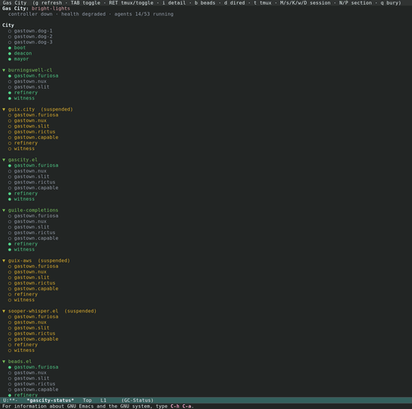

# gascity.el

A [Gas City](https://github.com/gastownhall/gascity) porcelain inside Emacs,
integrated with [beads.el](https://github.com/r0man/beads.el).

Gas City's `gc` CLI is the *plumbing*; gascity.el is the *porcelain*. Every view
is a function of `gc … --json` output: gascity renders gc's state and dispatches
its commands, keyboard-first, the way Magit fronts git. The UI is hand-built in
the magit/forge style — deliberately designed, sectioned, keyboard-driven
buffers — not auto-generated. See [docs/DESIGN.md](docs/DESIGN.md).

[](doc/images/status-dark.png)

## Documentation

A full **[user manual](doc/gascity.texi)** (Texinfo) covers installation, every
dashboard and list, the navigation and section model, the keymaps, the actions,
and customization — with screenshots. Build it to Info and styled HTML:

```sh
make -C doc          # doc/gascity.info and doc/gascity.html/
make -C doc info     # Info only
make -C doc html     # styled multi-page HTML only
```

Screenshots are produced by a reusable, documented pipeline under
[doc/screenshots/](doc/screenshots/README.md) (`make -C doc screenshots`).

## Status

A usable porcelain: an interactive status dashboard; tabulated list views with
window-sized pagination (`]`/`[`/`G`) and per-list `/` filters; agent actions
(Dired into a worktree, attach to a tmux session); mutating-command dispatch
(rig suspend/resume/restart, session nudge/suspend/kill/wake/drain, sling, order
run, city start/stop); and vui detail views — a rig dashboard and a
session/polecat detail. Bead-UI delegation and polish are planned (DESIGN.md §7,
§11).

## Requirements

- Emacs 29.1+
- The `gc` CLI on your `exec-path` (or set `gascity-executable`); for a
  remote city, on the host's `tramp-remote-path` — see
  [Remote cities (TRAMP)](#remote-cities-tramp)
- [beads.el](https://github.com/r0man/beads.el) (provides `beads-meta`,
  `beads-section`, `beads-terminal`) and [vui](https://github.com/r0man/vui)
- Optional: `vterm` or `eat` for a nicer tmux-attach terminal (falls back to the
  built-in `term`)

## Install

With the dependencies on your `load-path`:

```elisp
(add-to-list 'load-path "/path/to/gascity.el/lisp")
(require 'gascity)
```

## Usage

`M-x gascity` opens a dispatcher; or call a view directly:

| Command | View |
|---|---|
| `M-x gascity-status` | Status dashboard (city → rigs → agents), collapsible |
| `M-x gascity-rig-dashboard` | Rig dashboard (agents, beads, orders, Dolt) |
| `M-x gascity-rig-list` | Rigs |
| `M-x gascity-session-list` | Agent sessions |
| `M-x gascity-convoy-list` | Convoys |
| `M-x gascity-mail-inbox` | Mail inbox |
| `M-x gascity-order-list` | Orders |
| `M-x gascity-dolt-list` | Dolt databases |

### Keys

Everywhere: `g` refreshes, `q` buries, `RET` drills in. In the tabulated lists,
`]`/`[`/`G` page and `/` opens a filter.

- **Status dashboard:** `TAB` toggles a rig section (the magit convention);
  `RET` toggles the rig at point too, or attaches the agent's terminal (`i`
  opens its detail); `d` Dired into the worktree; `t` tmux attach;
  `M`/`s`/`K`/`w`/`D` nudge/suspend/kill/wake/drain the agent; `n`/`p` move by
  line, `N`/`P` jump between sections (city/rig/…).
- **Rig list:** `RET` opens the rig dashboard; `d` Dired into the rig directory;
  `s`/`r`/`R` suspend/resume/restart.
- **Session list:** `RET` opens the session/polecat detail; `d` Dired; `t` tmux
  attach; `M`/`s`/`K`/`w`/`D` session actions; `v` peeks at recent output;
  `n`/`p` move by line.
- **Rig dashboard:** agents table, ready/in-progress beads (`RET` → beads.el),
  rig-scoped orders, and Dolt stats; the agent action keys above act on the
  agent at point, and `N`/`P` jump between sections.
- **Session/polecat detail:** state, mail count, the bead on the hook, and
  recent history (`RET` → beads.el); `v` peek, `M` nudge, `D` drain, `s` suspend,
  `K` kill, `w` wake, `d` Dired, `t` tmux act on the subject agent; `n`/`p` move
  by line, `N`/`P` jump between sections.
- **Convoys:** `RET` opens the convoy bead via beads.el.
- **Orders:** `RET` opens the order's source file; `x` runs the order manually.

## Remote cities (TRAMP)

gascity is fully remote-capable: open any directory of a remote city over
TRAMP and start a view from there — every read, action, and refresh then runs
`gc` on that host, never a silent local fallback.

```
C-x d /ssh:user@example.com:/home/user/city/ RET
M-x gascity-status
```

Setup: usually none. A bare program name is resolved on the host —
first against `tramp-remote-path` (via `executable-find`), then, when
that misses, by probing the profile directories in
`gascity-remote-search-path`, by default the Guix profiles
(`~/.guix-home/profile/bin`, `~/.guix-profile/bin`,
`/run/current-system/profile/bin`). A host that installs `gc` and
`tmux` via Guix therefore works out of the box. Resolutions are cached
per connection; `M-x gascity-context-clear-cache` forgets them (e.g.
after moving a binary on the host). For other layouts, either extend
TRAMP's own search path:

```elisp
(add-to-list 'tramp-remote-path 'tramp-own-remote-path)
```

or set a per-host absolute path via connection-local profiles:

```elisp
(connection-local-set-profile-variables
 'gascity-remote-gc
 '((gascity-executable . "/home/user/.guix-home/profile/bin/gc")))
(connection-local-set-profiles
 '(:machine "example.com") 'gascity-remote-gc)
```

Notes:

- Views are keyed per city: buffer names are host-qualified
  (`*gascity-status@/ssh:user@example.com:*`), so a local and a
  remote dashboard coexist, and each view pins its `default-directory` to
  the city it was opened for — refresh timers keep hitting that host.
- Paths gc reports (agent worktrees, rig directories, order sources) are
  host-local; `d` (Dired) and `RET` re-prefix them and open them on the
  city's host.
- `t`/`RET` tmux attach spawns a **local** `ssh -t HOST env -u TMUX tmux …`
  in the terminal backend. Supported for the ssh-based TRAMP methods
  (`ssh`/`sshx`/`scp`/`scpx`); other methods and multi-hop names signal a
  clear error. The mode-line tmux status mirror probes the remote server on
  its timer. `tmux` is resolved on the host like `gc` (profile probing
  included), for the probes and for the ssh attach command alike.
- TRAMP's faster direct-async process mode is fully supported — enable it
  per connection via the connection-local variable
  `tramp-direct-async-process` to cut per-read overhead on the dashboard.
- Performance: each refresh is an ssh round trip. Emacs reuses the TRAMP
  connection, and the dashboard skips an auto-refresh tick while a load is
  still in flight; raise `gascity-status-auto-refresh-interval` on slow
  links.

## Customization

`M-x customize-group RET gascity RET`. Notably:

- `gascity-executable` — name/path of the `gc` binary (default `"gc"`).
- `gascity-remote-search-path` — remote directories probed for `gc`/`tmux`
  on a remote city when `tramp-remote-path` misses; defaults to the Guix
  profile bins.
- `gascity-terminal-backend` — `nil` (auto: vterm > eat > term), `vterm`, `eat`,
  or `term`, for tmux attach.
- `gascity-tmux-socket` — tmux server socket the agents run on. `nil`
  auto-detects it as the city name (gc runs one tmux server per city); set a
  string to override.

## Development

The standard quality gate is `scripts/gate.sh`, run from the repository root:

```sh
scripts/gate.sh
```

It runs the two offline checks that together guard the package:

1. `eldev compile --warnings-as-errors` — byte-compiles every file with
   warnings promoted to errors. This is the only check that catches
   undefined-function references (e.g. a keymap entry naming an action verb
   whose forward `declare-function` is missing): plain `eldev compile` reports
   them merely as warnings, and `eldev test` never sees them.
2. `eldev test` — the ERT suite.

Either check failing exits non-zero, so a diff that reintroduces such a
reference fails the gate before it can merge. The gate compiles the whole
package (not an "affected" subset) because the action verbs are wired across
files. Eldev resolves `beads.el`/`vui` from sibling checkouts — see the `Eldev`
file.
