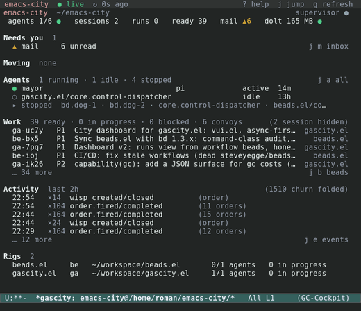

# gascity.el

⚠️ Status: Experimental

A [Gas City](https://github.com/gastownhall/gascity) porcelain inside Emacs,
integrated with [beads.el](https://github.com/r0man/beads.el).

Gas City's `gc` CLI is the *plumbing*; gascity.el is the *porcelain*. Every view
is a function of `gc … --json` output: gascity renders gc's state and dispatches
its commands, keyboard-first, the way Magit fronts git. The UI is hand-built in
the magit/forge style — deliberately designed, sectioned, keyboard-driven
buffers — not auto-generated. See [docs/DESIGN.md](docs/DESIGN.md).

[](doc/images/cockpit-dark.png)

## Documentation

A full **[user manual](doc/gascity.texi)** (Texinfo) covers installation, every
view, the navigation model, the keymaps, the actions, remote cities and
customization. Build it to Info and styled HTML:

```sh
make -C doc          # doc/gascity.info and doc/gascity.html/
make -C doc info     # Info only
make -C doc html     # styled multi-page HTML only
```

Screenshots are produced by a reusable, documented pipeline under
[doc/screenshots/](doc/screenshots/README.md) (`make -C doc screenshots`).

## Status

A usable porcelain: a city cockpit (what needs you, what is moving, who
works, what is queued, what just happened); the Agents view (table and tree)
and agent detail; Runs and run detail; a rig dashboard;
Health (supervisor, versions, stores, `gc doctor` on demand); Cities (every
city on every host); `gc costs`; an opt-in mode-line lighter; tabulated lists
with window-sized pagination and per-list `/` filters; and at-point actions
(nudge/suspend/kill/wake/drain/reset, rig suspend/resume/restart, sling, order
run, city lifecycle) that run in the background. Views refresh from one live
`gc events --follow` stream per city, never on a timer, and every view works
on a remote city over TRAMP. Still in progress (dashboard v3): the Events view
and the Mail view.

## Requirements

- Emacs 29.1+
- The `gc` CLI on your `exec-path` (or set `gascity-executable`); for a
  remote city, on the host's `tramp-remote-path` — see
  [Remote cities (TRAMP)](#remote-cities-tramp)
- [beads.el](https://github.com/r0man/beads.el) (provides `beads-meta`,
  `beads-section`, `beads-terminal`) and [vui](https://github.com/r0man/vui)
- Optional: `vterm` or `eat` for a nicer tmux-attach terminal (falls back to the
  built-in `term`)

## Install

With the dependencies on your `load-path`:

```elisp
(add-to-list 'load-path "/path/to/gascity.el/lisp")
(require 'gascity)
```

## Usage

`M-x gascity` opens a dispatcher; or call a view directly:

| Command | View |
|---|---|
| `M-x gascity-dashboard` | City cockpit: Needs you, Moving, Agents, Work, Activity, Rigs |
| `M-x gascity-agents` | Every agent (`T` toggles the rig/pool tree) |
| `M-x gascity-runs` | Workflow runs; `RET` run detail |
| `M-x gascity-rig-dashboard` | Rig dashboard (agents, beads, orders, Dolt) |
| `M-x gascity-health` | Supervisor, versions, stores, rig stores, `gc doctor` |
| `M-x gascity-cities` | Every city on this machine and the remote hosts |
| `M-x gascity-costs` | `gc costs` output |
| `M-x gascity-rig-list` | Rigs |
| `M-x gascity-session-list` | Agent sessions |
| `M-x gascity-convoy-list` | Convoys |
| `M-x gascity-mail-inbox` | Mail inbox |
| `M-x gascity-order-list` | Orders |
| `M-x gascity-dolt-list` | Dolt databases |
| `M-x gascity-mode-line-mode` | Global lighter: `GC[ec ■1▲2 · bl ▲1]` |

### Keys

Everywhere: `g` refreshes, `q` buries, `RET` drills in (never folds), `?`
shows every verb under the key it has in the views, `j` jumps to another view
(`j j` cockpit, `j a` agents, `j r` runs, `j b` beads, `j m` mail, `j h` health, `j c`
cities, `j o`/`j v`/`j d` orders/convoys/Dolt, `j g` rig dashboard, `j $`
costs), `/` opens the view's filter (changes apply at once, `x` resets), and
`S` slings. `TAB`/`S-TAB` move to the
next/previous thing (a section header, a row, a fold), `SPC` toggles the thing
at point: it folds a section, expands a fold row, or opens a row's inline
detail. In the tabulated lists `SPC` shows the row in a `*gascity-detail*` side
window (`C-o` shows it without selecting, `C-c C-f` makes it follow point, `q`
closes it first); `]`/`[`/`G` page, and sorting is a header click or `/ -S`.
`+`/`-` show ten more or fewer rows of the capped section at point (the
cockpit's sections, an unfolded churn row, the rig dashboard's bead sections;
the Runs history pages), never below the cap; `g` keeps the expansion and
`C-u g` resets it.

- **Cockpit:** at most five rows per section with a `… N more` line into the
  full view (`+` expands in place); noise (wisps, nudge beads, order churn, message beads) is hidden
  with a `(N hidden)` count and shown again from `/`; churn events fold into
  `×N` rows. On an agent row `RET` attaches its terminal, `i` opens its detail,
  `d`/`t`/`v` Dired/tmux/peek, `M`/`s`/`K`/`w`/`D`/`R`/`U`
  nudge/suspend/kill/wake/drain/reset/undrain; on a rig row `RET` opens the rig
  dashboard, `l` its git log, `s`/`r`/`R` suspend/resume/restart. `W` toggles
  the city's live event stream.
- **Rig list:** `RET` opens the rig dashboard; `d` Dired into the rig directory;
  `s`/`r`/`R` suspend/resume/restart.
- **Agents:** every agent, stalled ones pinned first; `T` toggles the
  city → rig → pool tree; `/` filters by state, rig, provider, search; the
  agent keys above apply.
- **Agent detail** (`i` anywhere): header, Work, Run, Transcript, Mail,
  History; `f` follows the log, `v` peeks, the agent keys act on the
  buffer's agent wherever point is.
- **Runs:** active, waiting and failed runs as cards with their step
  ladder; `RET` run detail (steps, loops, plan files, convoy; `C` shows
  control nodes), `b` the root bead, `H` history, `/` rig/formula/state/window.
- **Session list:** `RET` attaches; `i` detail; `d` Dired; the session
  actions and `v` peek.
- **Rig dashboard:** agents table, ready/in-progress beads (`RET` → beads.el),
  rig-scoped orders, and Dolt stats; the agent action keys above act on the
  agent at point, and `N`/`P` jump between sections.
- **Convoys:** `RET` opens the convoy bead via beads.el.
- **Orders:** `RET` opens the order's source file; `x` runs the order manually.
- **Health:** `!` runs `gc doctor` in the background (never on open or `g`;
  the report is cached with its age), `F` runs `--fix` after confirmation;
  failed and warned checks get a row each, `SPC` shows a check's fix hint.
- **Cities:** `RET` opens that city's cockpit, on its host; hosts are the local
  one, `gascity-remote-hosts`, and every remote host visited this session.
- **Lighter:** `gascity-mode-line-mode` shows each open cockpit's Needs you
  totals; `mouse-1` opens the cockpit. It never runs `gc` at redisplay.

### Actions never block

An action asks for what it needs (a confirmation, a nudge message, the sling
transient), then starts `gc` in the background and returns. The row shows `…`
until gc answers; success is echoed (`Suspended mayor`); a failure echoes gc's
first error line and logs the rest to `*gascity-log: CITY*`. Every process has
a deadline (`gascity-remote-async-timeout`, 30 s).

## Remote cities (TRAMP)

gascity is fully remote-capable: open any directory of a remote city over
TRAMP and start a view from there — every read, action, and refresh then runs
`gc` on that host, never a silent local fallback.

```
C-x d /ssh:user@example.com:/home/user/city/ RET
M-x gascity-dashboard
```

Setup: usually none. A bare program name is resolved on the host —
first against `tramp-remote-path` (via `executable-find`), then, when
that misses, by probing the profile directories in
`beads-remote-search-path` (shared with beads.el), by default the Guix
profiles (`~/.guix-home/profile/bin`, `~/.guix-profile/bin`,
`/run/current-system/profile/bin`), then Nix and `~/.local/bin`, `~/bin`. A host that installs `gc` and
`tmux` via Guix therefore works out of the box. Resolutions are cached
per connection; `M-x gascity-context-clear-cache` forgets them (e.g.
after moving a binary on the host). For other layouts, either extend
TRAMP's own search path:

```elisp
(add-to-list 'tramp-remote-path 'tramp-own-remote-path)
```

or set a per-host absolute path via connection-local profiles:

```elisp
(connection-local-set-profile-variables
 'gascity-remote-gc
 '((gascity-executable . "/home/user/.guix-home/profile/bin/gc")))
(connection-local-set-profiles
 '(:machine "example.com") 'gascity-remote-gc)
```

Notes:

- Views are keyed per city: buffer names are host-qualified
  (`*gascity: city@/ssh:user@example.com:/home/user/city/*`), so a local and a
  remote view coexist; the header line shows `@host`.
- Transport: for a single-hop ssh-family city every background read and
  action runs as a **local** `ssh -T` pipe process (`gascity-remote-transport`,
  default `ssh`; `tramp` uses TRAMP's `make-process` and is a fallback
  without the responsiveness guarantees: over ssh each read pays TRAMP's
  remote-shell setup, so prefer `ssh` or TRAMP direct-async). Starting one never
  blocks Emacs, output is byte-exact, and the processes share one ssh master
  (`gascity-remote-ssh-options`). ssh runs with `BatchMode=yes`: key or agent
  authentication is required.
- At most `gascity-remote-max-inflight` (3) gc processes run per host and lane;
  each is killed after `gascity-remote-async-timeout` (30 s), keeping the
  section's last good data marked `◐ timed out`. An unreachable host shows
  once as `○ offline @host` and is retried with backoff.
- Paths gc reports (agent worktrees, rig directories, order sources) are
  host-local; `d` (Dired) and `RET` re-prefix them and open them on the
  city's host.
- Live refresh: one `gc events --follow` stream per city (a local `ssh -T`
  pipe for a remote city) drives every refresh, batched for 2.5 s — no
  polling timer. `W` turns it off, `g` refreshes and reconnects; the header
  shows `● live`, `○ live off`, `○ live: reconnecting (Ns)`, `○ live:
  supervisor down` or `○ offline @host`.
- `t`/`RET` tmux attach spawns a **local** `ssh -t HOST env -u TMUX tmux …`
  in the terminal backend, for the ssh-based TRAMP methods.
- ssh configuration: TRAMP's own connection (Dired, first contact) can freeze
  Emacs in two known ways. Turn off X11 forwarding for city hosts
  (`ForwardX11 no` — with it on, xauth warnings can hide TRAMP's prompt), and
  if a remote city ever freezes inside a TRAMP wait, set
  `(setq tramp-use-connection-share 'suppress)` (costs one ssh handshake per
  TRAMP connection). See the manual's *Remote Cities* chapter.

## Customization

`M-x customize-group RET gascity RET`. Notably:

- `gascity-executable` — name/path of the `gc` binary (default `"gc"`).
- `beads-remote-search-path` (beads.el, formerly
  `gascity-remote-search-path`) — remote directories probed for
  `gc`/`tmux`/`bd` on a remote city when `tramp-remote-path` misses;
  defaults to the Guix, Nix and `~/.local/bin` profile bins.
- `gascity-terminal-backend` — `nil` (auto: vterm > eat > term), `vterm`, `eat`,
  or `term`, for tmux attach.
- `gascity-tmux-socket` — tmux server socket the agents run on. `nil`
  auto-detects it as the city name (gc runs one tmux server per city); set a
  string to override.
- `gascity-remote-hosts` — extra hosts the Cities view lists.
- `gascity-remote-transport`, `gascity-remote-max-inflight`,
  `gascity-remote-async-timeout` — remote cities, see above.

## Development

The standard quality gate is `scripts/gate.sh`, run from the repository root:

```sh
scripts/gate.sh
```

It runs the two offline checks that together guard the package:

1. `eldev compile --warnings-as-errors` — byte-compiles every file with
   warnings promoted to errors. This is the only check that catches
   undefined-function references (e.g. a keymap entry naming an action verb
   whose forward `declare-function` is missing): plain `eldev compile` reports
   them merely as warnings, and `eldev test` never sees them.
2. `eldev test` — the ERT suite.

Either check failing exits non-zero, so a diff that reintroduces such a
reference fails the gate before it can merge. The gate compiles the whole
package (not an "affected" subset) because the action verbs are wired across
files. Eldev resolves `beads.el`/`vui` from sibling checkouts — see the `Eldev`
file.
